# Ejercicio tipo prueba - DEMO_2

## Parte 1 - Conceptos básicos:

1. ¿Cuál es la diferencia entre HTTP y HTTPS y qué rol cumple TLS?
- HTTP (HyperText Transfer Protocol): Protocolo para la transferencia de información en la web sin cifrado.
- HTTPS (HTTP Secure): Es HTTP pero con cifrado seguro usando TLS (Transport Layer Security).
- TLS: Protocolo criptográfico que cifra los datos enviados entre cliente y servidor. Asegura:
    - Confidencialidad (nadie puede leer los datos).
    - Integridad (los datos no se modifican en tránsito).
    - Autenticidad (se verifica la identidad del servidor).
- En suma: HTTPS = HTTP + TLS.

2. Explicar brevemente WSGI y ASGI en el ecosistema Python. ¿Cuál soporta Django hoy?
- WSGI (Web Server Gateway Interface):
    - Estándar para apps sincrónicas en Python (por ejemplo, Flask, Django tradicional).
    - Es bloqueante: cada solicitud se procesa completamente antes de pasar a la siguiente.
- ASGI (Asynchronous Server Gateway Interface):
    - Evolución de WSGI.
    - Soporta apps asíncronas y sincrónicas, ideal para WebSockets, tareas en tiempo real, etc.
- Django hoy (desde 3.0+) soporta ambos: WSGI para apps tradicionales y ASGI para características asíncronas.

3. ¿Qué es un registro A y un CNAME en DNS y cuándo usarías cada uno?
- Registro A (Address): Asocia un nombre de dominio a una dirección IP.
    - Ej: example.com → 192.0.2.1
    - Se usa para dominios raíz y cuando quieres apuntar directamente a un servidor.
- Registro CNAME (Canonical Name): Asocia un dominio a otro nombre de dominio.
    - Ej: www.example.com → example.com
    - Útil para subdominios o cuando apuntas a servicios externos (como app.example.com → hosting.external.com).

4. En REST, ¿cuándo corresponde usar GET vs POST (ejemplo concreto)?
- GET:
    - Usado para obtener datos sin efectos secundarios.
    - Ejemplo: GET /api/productos/42 → devuelve los datos del producto con ID 42.
- POST:
    - Usado para crear recursos o enviar datos para procesamiento.
    - Ejemplo: POST /api/ordenes con datos del carrito → crea una nueva orden de compra.
- Regla general: GET no cambia el estado del servidor; POST sí.

5. ¿Qué capa de MVC “controla” el flujo de peticiones en Django?

    Django no sigue estrictamente el patrón MVC tradicional, sino una variante propia llamada MTV:

    | MVC tradicional | Django           | Rol                                 |
    | --------------- | ---------------- | ----------------------------------- |
    | Model           | Model            | Acceso a datos y lógica del negocio |
    | View            | Template         | Presentación (HTML)                 |
    | Controller      | View (en Django) | Lógica que responde a peticiones    |

    En Django, las funciones o clases en views.py (las “Vistas”) son las que actúan como el "Controlador" del patrón MVC, ya que:

    - Reciben la petición HTTP.
    - Procesan lógica (directamente o con ayuda de modelos).
    - Preparan y devuelven una respuesta (por ejemplo, renderizar un template).
    - En suma, aunque Django lo llama "View", la capa de views.py es la que realmente controla el flujo de peticiones — por eso puede parecer confuso.

## Parte 2 - Configuración base:

- Crear y activar entorno virtual.
- Instalar Django.
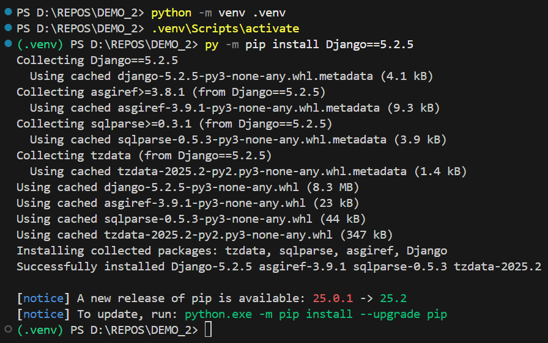

- Crear proyecto y aplicación.
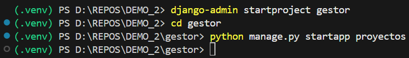

- Registrar la aplicación en el proyecto, y otras configuraciones.
    - En la lista INSTALLED_APPS agregar la app.
    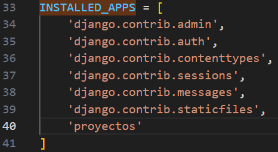
    - Cambiar LANGUAGE_CODE = 'en-us' por LANGUAGE_CODE = 'es-cl'.
    - Cambiar TIME_ZONE = 'UTC' por TIME_ZONE = 'America/Santiago'.
    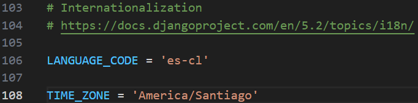
    - Generar la carpeta templates; cambiar 'DIRS': [], por 'DIRS': [BASE_DIR / 'templates'].
    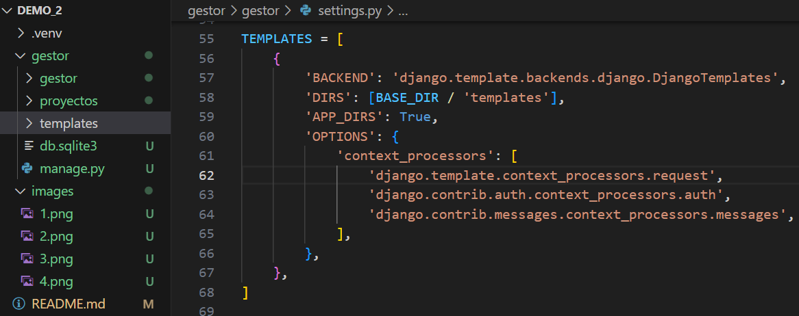

- Ejecutar el servidor de desarrollo.
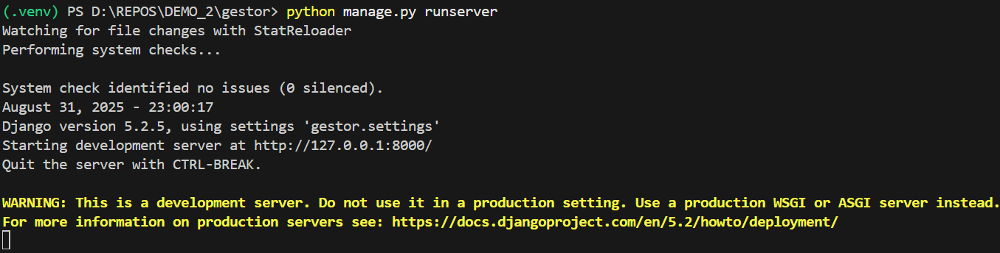

## Parte 3 - Modelos:

- A partir de los modelos, crear migraciones y aplicarlas a la base de datos.
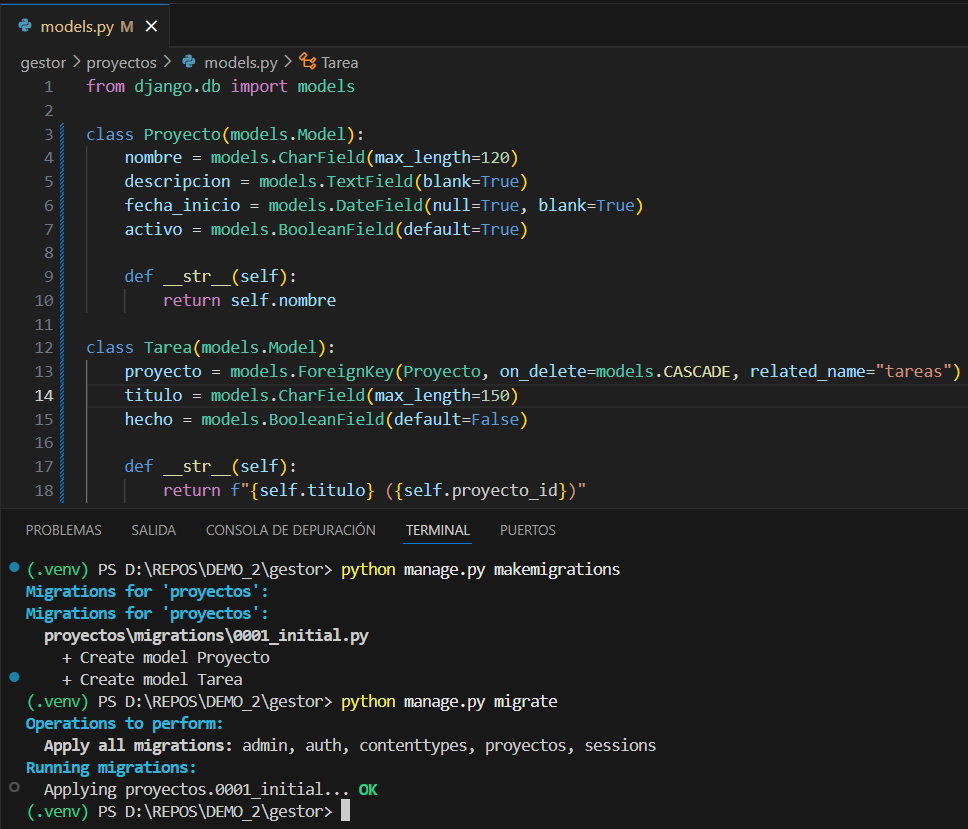

- Crear superusuario.
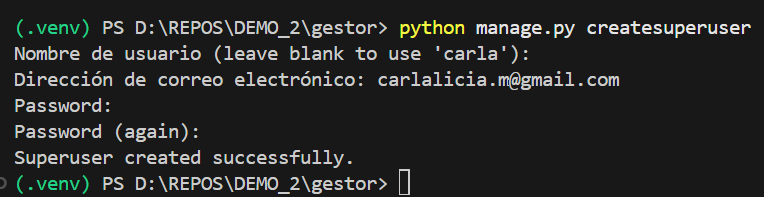

- Registrar modelos y cargar por shell dos proyectos con dos tareas cada uno.
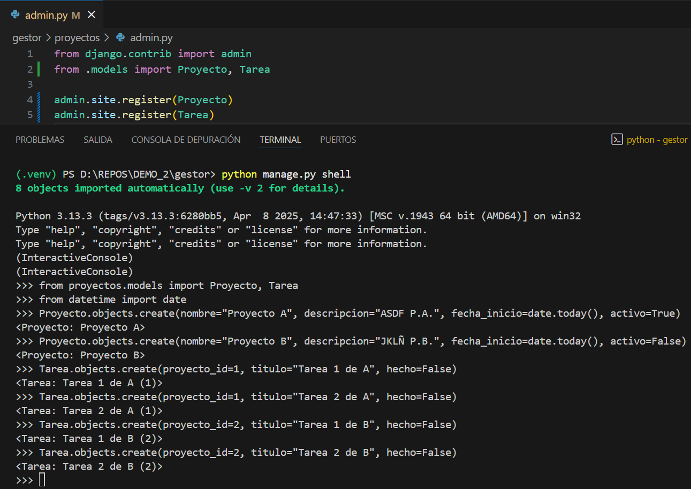

## Parte 4 - Rutas + Vistas + Templates:

- Interfaz.
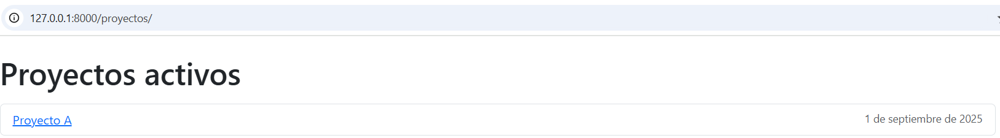
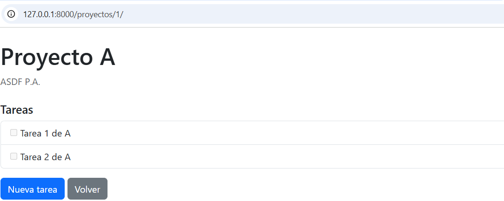
